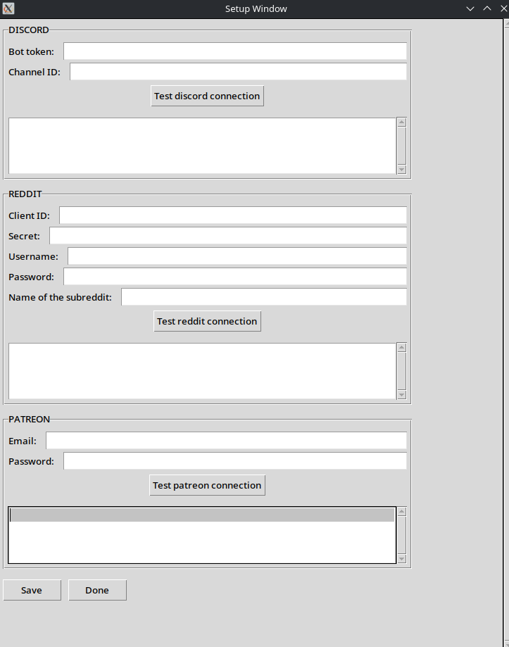
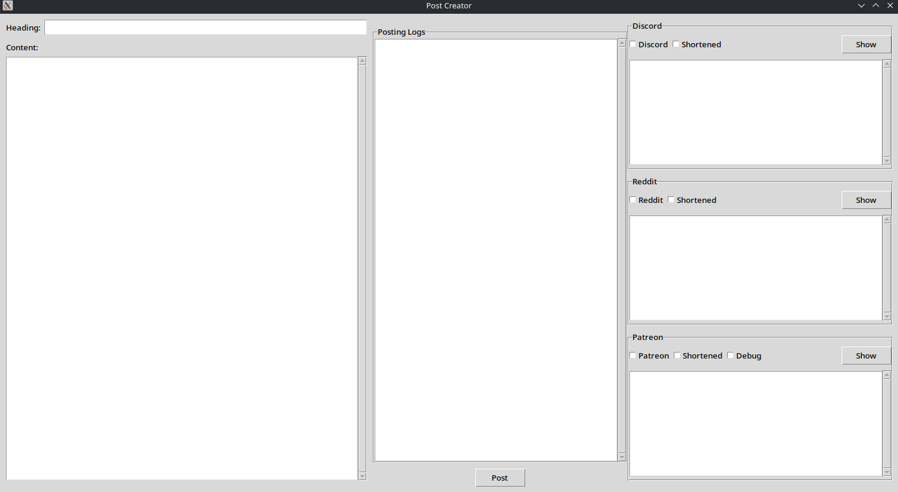

# Project Suzuka

**Project Suzuka** is a Python-based automation tool for posting content across multiple platforms, including Discord, Reddit, and Patreon.  
It includes both a setup interface for managing API keys and a posting app that formats and distributes content to selected platforms.

---

## Features

### Setup Environment App

- Graphical interface for inputting and managing API tokens  
- Supports saving keys as secure local environment variables  
- Keys can be tested and overwritten by saving a new value under the same name  
- Works with Discord, Reddit, and Patreon (more platforms easily addable)

**Screenshot:**  


---

### Posting App

- GUI with input fields for title and text  
- Automatically generates short-form versions from longer content  
- Lets you select which platforms to post to  
- Shows basic logs and results  
- Supports Discord, Reddit, and Patreon

**Screenshot:**  


**Note:**  
Patreon posting uses Selenium browser automation rather than an official API (because Patreon’s API is restrictive for posting). This is not a long-term solution and may no longer function reliably.

---

## Current State

- Automatic scheduled posting using `cron` is supported (currently not required)  
- Python environment setup is handled by script  
- Fully working setup and posting apps  
- Modular design for platform extension

---

## Setup Instructions

1. Open a terminal in the `project_suzuka-main/` directory.  
2. Make the setup script executable:
   ```bash
   sudo chmod +x posting/setup.sh
   ```
3. Run the setup script:
   ```bash
   bash posting/setup.sh
   ```
   This installs dependencies and creates two command files in the root directory:
   - `run_post.sh` – Launches the posting interface  
   - `setup_env.sh` – Launches the API key setup interface

4. To run either of the apps:
   - Double-click the `.sh` file, or  
   - If that fails, right-click and choose "Run as a program", or  
   - Run it manually from terminal:
     ```bash
     ./run_post.sh
     ```

---

## Documentation

Platform-specific usage instructions and tutorials are provided in the `project_suzuka-main/posting/tutorials/` directory as plain `.txt` files.

---

## TODO / Planned Features

- Improve Reddit support for rich text (bold, links, etc.)  
- Add support for posting images to Reddit  
- Add submission verification to detect failed or deleted posts  
- Add Twitter integration using their API  
- Explore LinkedIn integration

---

## Project Status

This project was paused in late-stage development and is not actively maintained.  
However, core functionality for posting and environment configuration is complete and operational.

---

## Tech Stack

- **Python** — Core language for both the setup and posting apps  
- **Shell scripting** (`.sh`) — Used for setup automation and app launching  
- **Selenium** — Used for automating Patreon posts via browser (not API-based)  
- **discord.py** — For posting to Discord  
- **PRAW (Python Reddit API Wrapper)** — For posting to Reddit  
- **python-dotenv** — Loads environment variables from `.env` files  
- **re** — Used for text parsing and pattern matching  
- **Tkinter** — Used for building the GUI interfaces

---

## License

[Specify your license here, e.g., MIT, Apache 2.0, or leave this section out if undecided.]

---

## Contributing

Contributions are welcome. Feel free to fork the project or submit pull requests to extend functionality or improve code quality.
